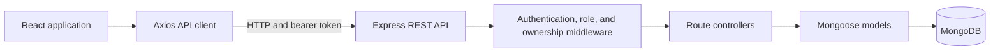

# OpenBook — E-Learning Course Progress Tracker

OpenBook is a course platform with separate learner and instructor workflows. Learners enroll in courses and record lesson completion. Instructors manage their courses and view aggregate completion rates.

## Features

- Course catalog with search and category filters
- Course enrollment and lesson-by-lesson progress tracking
- Course and lesson management for instructors
- Learner progress and instructor completion analytics
- JWT authentication and role-based route access
- Responsive React interface with loading, empty, and error states

## Architecture



The browser stores the signed-in user and JWT in local storage. The Axios client attaches the token to API requests. Express verifies it, checks role and course ownership where required, then controllers read or update MongoDB through Mongoose.

### Data model

- **User** stores account details, a hashed password, and the `learner` or `instructor` role.
- **Course** references its instructor and lessons, and stores enrolled learners.
- **Lesson** belongs to a course and has an order, content, and optional duration.
- **Progress** links a learner, course, and lesson. A unique learner/lesson index prevents duplicate progress records.
- Course completion is calculated from the learner’s completed lessons.

### Repository structure

```text
backend/
  config/          MongoDB connection
  controllers/     Authentication, courses, lessons, and progress
  middleware/      Authentication, roles, ownership, and validation
  models/          User, Course, Lesson, and Progress schemas
  routes/          Express API routes
  seed.js          Sample instructors, courses, and lessons
  server.js        Express application entry point
frontend/
  src/api/         Axios client and endpoint helpers
  src/components/  Shared interface components
  src/context/     Authentication and toast contexts
  src/pages/       Application pages
  src/styles/      Application styles
postman/
  collections/     API request definitions
```

## Technology

- **Frontend:** React 18, Vite, React Router, Axios, lucide-react
- **Backend:** Node.js, Express, Mongoose
- **Database:** MongoDB
- **Authentication:** JSON Web Tokens and bcryptjs

## Run locally

### Requirements

- Node.js 18 or later and npm
- A MongoDB database, hosted or local

### Start the backend

```bash
cd backend
npm install
cp .env.example .env
```

Set the values in `backend/.env`. For the local frontend configuration below, use port `5001`:

```env
PORT=5001
MONGO_URI=mongodb+srv://<username>:<password>@<cluster>/<database>
JWT_SECRET=<long-random-secret>
JWT_EXPIRES_IN=7d
```

Start the API:

```bash
npm run dev
```

The API runs at `http://localhost:5001`. Its health endpoint is `http://localhost:5001/api/health`.

### Add sample data (optional)

In a second terminal, from the project directory:

```bash
cd backend
npm run seed
```

This creates or updates seven sample courses with 40 lessons and instructor accounts in the configured database. The seed script writes to the database. It does not create the separate accounts used by the login page’s quick-demo buttons; on a fresh database, register an account and sign in normally.

### Start the frontend

In another terminal, from the project directory:

```bash
cd frontend
npm install
```

Create `frontend/.env`:

```env
VITE_API_BASE_URL=http://localhost:5001/api
```

Then start Vite:

```bash
npm run dev
```

Open the local URL printed by Vite, usually `http://localhost:5173`.

## Application routes

| Route | Page | Access |
| --- | --- | --- |
| `/` | Landing page | Public |
| `/login`, `/register` | Sign in and registration | Public |
| `/dashboard` | Role-specific overview | Signed-in users |
| `/courses` | Catalog or instructor course list | Signed-in users |
| `/courses/:id` | Course curriculum and lesson reader | Signed-in users |
| `/courses/new` | Create a course | Instructor |
| `/courses/:id/edit` | Manage lessons | Course owner |
| `/learning` | Enrolled course progress | Learner |
| `/analytics` | Course completion analytics | Instructor |

## API overview

API responses use `{ "message": "…", "data": … }`. Health, registration, and login are public. Other routes require a bearer token.

| Method | Route | Description |
| --- | --- | --- |
| `GET` | `/api/health` | API health check |
| `POST` | `/api/auth/register` | Register a learner or instructor |
| `POST` | `/api/auth/login` | Sign in and receive a token |
| `GET` | `/api/courses` | List courses |
| `POST` | `/api/courses` | Create a course (instructor) |
| `GET` | `/api/courses/:id` | Get course details and lessons |
| `PUT`, `DELETE` | `/api/courses/:id` | Update or delete an owned course |
| `POST` | `/api/courses/:id/enroll` | Enroll in a course (learner) |
| `GET` | `/api/courses/:courseId/lessons` | List course lessons |
| `POST` | `/api/courses/:courseId/lessons` | Add a lesson (course owner) |
| `PUT`, `DELETE` | `/api/courses/:courseId/lessons/:id` | Update or delete a lesson (course owner) |
| `POST` | `/api/lessons/:id/complete` | Complete a lesson (enrolled learner) |
| `GET` | `/api/courses/:id/progress` | Read learner progress |
| `GET` | `/api/courses/:id/completion-rate` | Read completion analytics (course owner) |

## Build the frontend

```bash
cd frontend
npm run build
```

The production files are written to `frontend/dist/`. API request definitions are available under `postman/collections/`.
